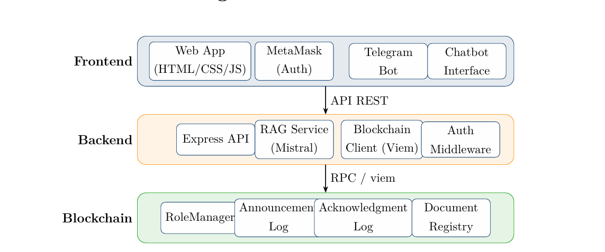
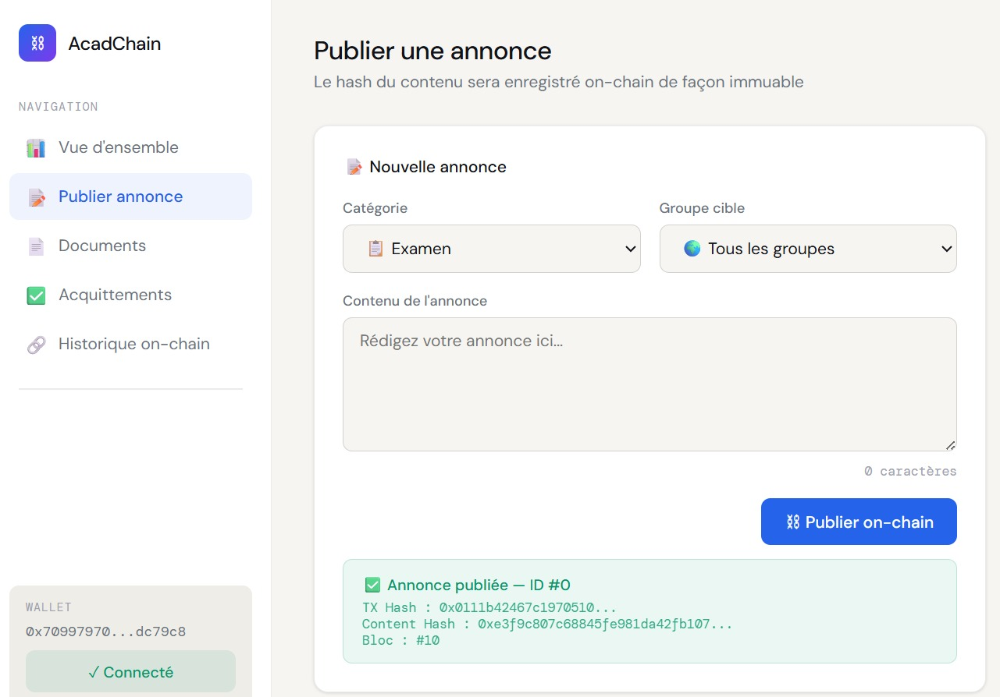
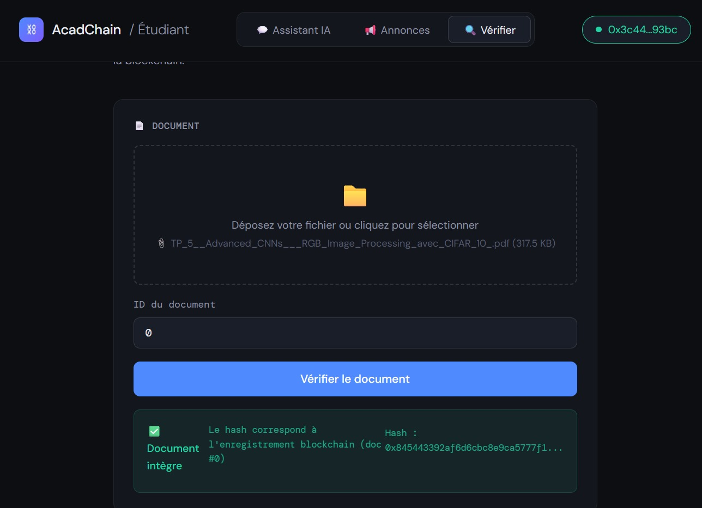
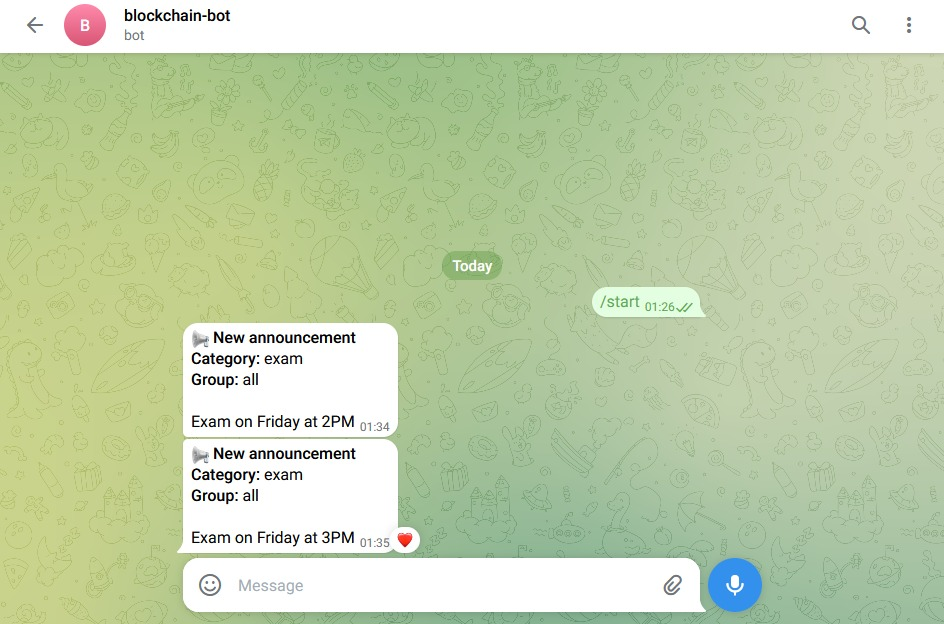
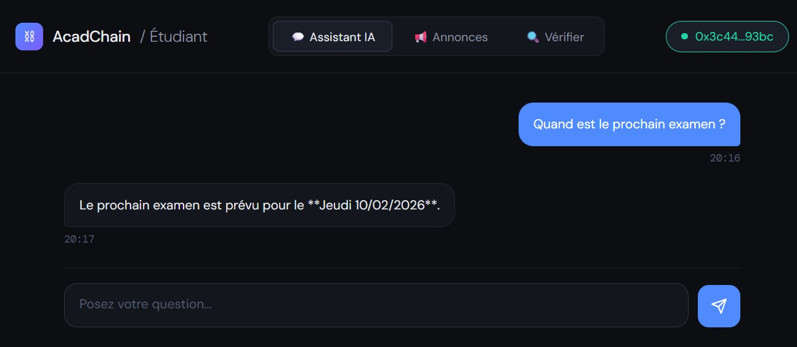

<<<<<<< HEAD
# Decentralized Academic Assistant

A blockchain-based academic assistant that combines
smart contracts, decentralized storage and AI-powered
document retrieval.

## Features

- Student registration
- Academic record management
- Certificate issuance
- Smart contracts on Ethereum
- AI/RAG academic assistant
- Web3 frontend

## Technologies

- Solidity
- Hardhat
- Node.js
- Express.js
- MetaMask
- Ethereum Sepolia
- OpenAI/Ollama
- HTML/CSS/JavaScript

## Architecture



## Prerequisites

- Node.js (v18 or higher)
- npm (v9 or higher)
- Git
- MetaMask browser extension

## Installation

### 1. Clone the Repository

```bash
git clone https://github.com/DiawaraNana/blockchain-academic-assistant.git

cd blockchain_academic_assistant
```

### 2. Install Root Dependencies

```bash
cd "to send last"
npm install
```

### 3. Install Backend Dependencies

```bash
cd backend
npm install
cd ..
```

### 4. Environment Configuration

Create a `.env` file in the root (`project/`) directory with:

```
PRIVATE_KEY=<your-wallet-private-key>
SEPOLIA_RPC_URL=<your-sepolia-rpc-url>
OPENAI_API_KEY=<your-openai-api-key>
```

Create a `.env` file in the backend directory (`academic_assistant/backend/`) with:

```
OPENAI_API_KEY=<your-openai-api-key>
MISTRAL_API_KEY=<your-mistral-api-key>
PRIVATE_KEY=<your-wallet-private-key>
```

## Running the Project

### Smart Contracts

```bash
# Compile contracts
npx hardhat compile

# Run tests
npx hardhat test

# Deploy contracts (make sure to set up .env first)
npx hardhat run scripts/deploy.js --network sepolia
```

### Backend Server

```bash
cd backend
npm start
```

The backend server will run on `http://localhost:3000` by default.

### Frontend

Open the frontend HTML files in your browser:
- Professor interface: Open `frontend/professor.html`
- Student interface: Open `frontend/student.html`

Or serve them using a local web server:

```bash
# If you have Python installed
python -m http.server 8000

# Then visit http://localhost:8000/frontend/professor.html
```

## Screenshots




=======
# blockchain-academic-assistant
Decentralized Academic Assistant built with Solidity, Node.js, AI/RAG and Web3 technologies.
>>>>>>> 0c57c310984e31bf320a135c79146e5048d67da6
